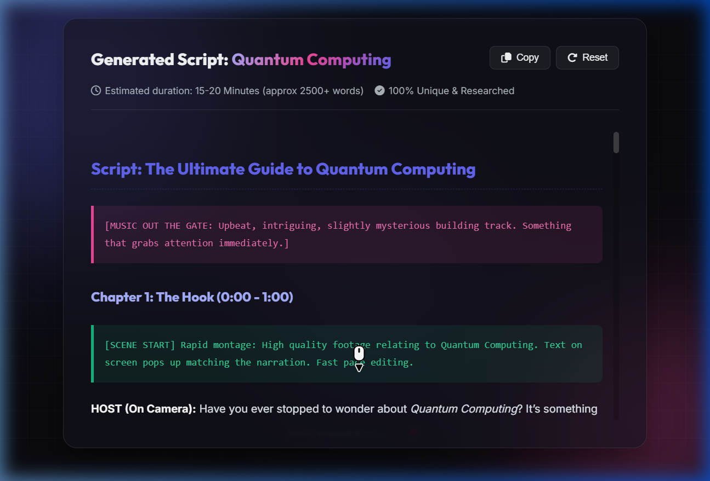

<div align="center">
  
  
  
</div>

<h1 align="center">🎥 YouTube Script Generator</h1>

<p align="center">
  <strong>An elegant, dark-mode, AI-powered script generator for YouTube videos.</strong><br>
  Built entirely with Vanilla Web Technologies for instant, dependency-free execution.
</p>

## ✨ Features
- **Premium Dark Mode UI**: Crafted with responsive glassmorphism, dynamic glowing orbs, and professional typography.
- **Deep Research Simulation**: Interactive loading sequences that visualize the analytical "Deep Research" pipeline.
- **Dynamic Script Scaffolding**: Automatically scales script structures (Hook, Body, Conclusion) based on the chosen duration.
- **Formatting Ready**: Output is cleanly formatted with explicit visual cues, audio cues, and clear section breaks.

## 🖼️ Preview
<div align="center">
  
</div>

## 🚀 Getting Started

Since this project has **zero dependencies**, running it is instant.

1. **Clone the repository:**
   ```bash
   git clone <your-repo-url>
   cd yt-script-generator
   ```
2. **Open the App:**
   Simply double-click on `index.html` to open it in any modern browser!
   
   *(Optional)* For the best experience, host it on a local development server:
   ```bash
   python -m http.server 8000
   ```
   Then navigate to `http://localhost:8000`

## 🛠️ Built With
* [HTML5](https://developer.mozilla.org/en-US/docs/Web/HTML)
* [CSS3](https://developer.mozilla.org/en-US/docs/Web/CSS)
* [Vanilla JavaScript](https://developer.mozilla.org/en-US/docs/Web/JavaScript)
* [Google Fonts](https://fonts.google.com/) (Inter & Outfit)
* [FontAwesome](https://fontawesome.com/) (Icons)

## 📝 License
This project is licensed under the [MIT License](LICENSE).
